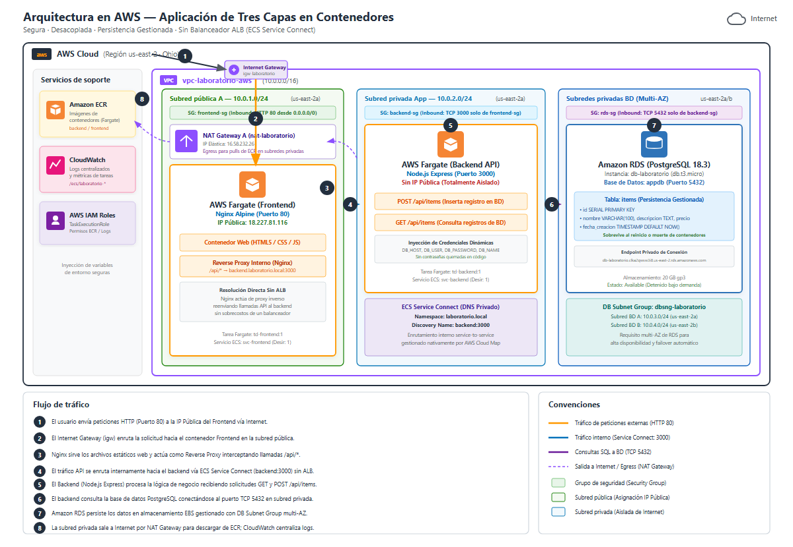

# Laboratorio Práctico: Arquitectura en AWS
## Universidad Tecnológica de Panamá · FISC · Ingeniería de Software
**Asignatura:** Tópicos Especiales 1 | **Facilitador:** José Grimaldo | **Grupo:** 1SF241 | **II Semestre 2026**

---

### 👥 Integrantes del Equipo
* **Diego Gordón** — `8-1017-349`
* **Manuel Campos** — `8-1022-1118`
* **Fernando Jimenez** — `20-24-7669`
* **Bryan Law** — `8-104-2459`
* **Alexis Miranda** — `9-765-1202`

---

## 1. Diagrama de Arquitectura de la Solución

### Flujo de Tráfico Numerado:
1. **Acceso de Usuarios:** El usuario envía peticiones HTTP (Puerto 80) a la IP Pública del Frontend (`18.227.81.116`) a través de Internet.
2. **Recepción en Internet Gateway:** El `igw-laboratorio` enruta la solicitud hacia el contenedor Frontend ubicado en la subred pública (`10.0.1.0/24`).
3. **Servidor Web y Reverse Proxy:** Nginx sirve la interfaz web (HTML5/CSS3/JS) y actúa como Reverse Proxy interceptando las llamadas `/api/*`.
4. **Enrutamiento Interno (Sin ALB):** El tráfico API se enruta internamente hacia el backend vía ECS Service Connect (`backend:3000`) sin necesidad de un balanceador ALB.
5. **Procesamiento de Negocio:** El contenedor Backend (Node.js Express) en la subred privada procesa las solicitudes `GET /api/items` y `POST /api/items`.
6. **Conexión a Base de Datos:** El backend consulta PostgreSQL conectándose al puerto TCP 5432 en las subredes privadas de datos.
7. **Persistencia Gestionada en RDS:** Amazon RDS persiste los datos en almacenamiento EBS gestionado y cuenta con DB Subnet Group multi-AZ para resiliencia.
8. **Egress y Monitoreo:** La subred privada sale a Internet por NAT Gateway para descargar de ECR; CloudWatch centraliza los logs (`/ecs/laboratorio-*`).

### Convenciones de Red:
* **Tráfico externo:** Flecha continua naranja (HTTP 80).
* **Tráfico interno:** Flecha continua azul (Service Connect TCP 3000).
* **Consultas SQL:** Flecha continua morada (PostgreSQL TCP 5432).
* **Salida a Internet (Egress):** Flecha discontinua violeta (NAT Gateway).
* **Grupos de Seguridad (SG):** `frontend-sg`, `backend-sg`, `rds-sg`.
* **Subred Pública:** `10.0.1.0/24` en `us-east-2a`.
* **Subredes Privadas:** `10.0.2.0/24` (App), `10.0.3.0/24` y `10.0.4.0/24` (RDS Multi-AZ).

---

## 2. Explicación de la Arquitectura Propuesta

La arquitectura desarrollada para la aplicación de tres capas se encuentra desplegada en AWS en la región de Ohio (`us-east-2`), utilizando una VPC con direccionamiento `10.0.0.0/16` distribuida en subredes públicas y privadas con el propósito de garantizar seguridad perimetral y aislamiento de red. El flujo inicia cuando los usuarios externos acceden a la aplicación mediante peticiones HTTP en el puerto estándar 80. Las solicitudes son recibidas e introducidas a la red interna a través del Internet Gateway (`igw-laboratorio`), punto de enlace entre la VPC y la red pública.

En cumplimiento con la restricción técnica de no utilizar un Application Load Balancer (ALB), la capa de presentación se resolvió mediante un contenedor Nginx Alpine sobre AWS Fargate, situado en una subred pública (`10.0.1.0/24`) con IP pública (`18.227.81.116`). Nginx cumple una doble función esencial: sirve los archivos estáticos de la interfaz web (HTML5, CSS3 y JavaScript asíncrono) y opera simultáneamente como Reverse Proxy de capa 7, interceptando de forma transparente las peticiones dirigidas a la ruta `/api/*` para reenviarlas directamente hacia el backend.

El tráfico API es enrutado de forma interna hacia la capa de aplicación, la cual reside en una subred privada (`10.0.2.0/24`) desprovista de IP pública para impedir cualquier acceso directo no autorizado. La comunicación de servicio a servicio se articula mediante AWS Cloud Map y ECS Service Connect bajo el namespace privado `laboratorio.local`. De este modo, el frontend invoca de forma directa al backend (`backend:3000`), donde un servicio Node.js Express procesa la lógica de negocio y atiende las operaciones `GET /api/items` y `POST /api/items`.

Para la persistencia de datos, el backend se conecta mediante TCP en el puerto 5432 con una instancia de Amazon RDS PostgreSQL 18.3 (`db.t3.micro`), ubicada en subredes privadas de datos (`10.0.3.0/24` y `10.0.4.0/24`). La base de datos está asociada a un DB Subnet Group (`dbsng-laboratorio`) que abarca dos Zonas de Disponibilidad (`us-east-2a` y `us-east-2b`) para alta disponibilidad. La tabla `items` gestiona los registros con clave primaria autoincremental y fecha de auditoría, garantizando la persistencia definitiva de la información en volúmenes EBS administrados, aun tras reinicios de los contenedores.

Finalmente, los contenedores en subredes privadas descargan imágenes desde repositorios de Amazon ECR mediante un NAT Gateway (`nat-laboratorio`) con Elastic IP (`16.58.232.26`). Amazon CloudWatch centraliza los registros de logs (`/ecs/laboratorio-*`), mientras que Security Groups dedicados (`frontend-sg`, `backend-sg` y `rds-sg`) gobiernan el tráfico limitando los accesos bajo el principio de mínimo privilegio e inyectando credenciales por variables de entorno seguras. Esta arquitectura desacoplada proporciona una solución escalable, modular y resiliente.
